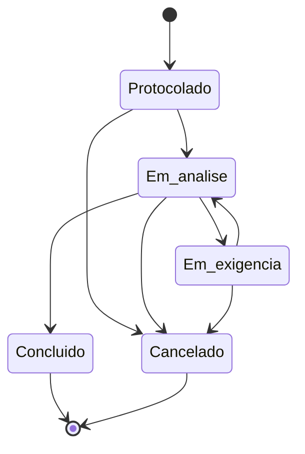

# Ofício Digital — sistema de protocolos de cartório

Aplicação full stack para registrar e acompanhar pedidos de serviços cartorários. O projeto foi construído para o desafio técnico da Codeform, com foco no núcleo pedido: regras de transição no backend, histórico auditável e numeração anual segura sob concorrência.

## O que está implementado

- Criação, consulta, edição e exclusão lógica de pedidos;
- listagem paginada com filtro por status e tipo e busca por protocolo, solicitante, descrição ou tipo;
- detalhe do pedido com histórico cronológico;
- máquina de estados validada exclusivamente no backend;
- protocolo no formato `AAAA/NNNNNN`, reiniciado a cada ano;
- alocação transacional de protocolo, sem duplicidades ou números consumidos por transações abortadas;
- seed idempotente de tipos de pedido;
- documentação OpenAPI/Swagger;
- frontend responsivo com estados de carregamento, erro e lista vazia;
- testes unitários das regras de transição e teste de integração de concorrência;
- ambiente completo via Docker Compose.

## Stack e estrutura

- **Frontend:** Next.js 16, React 19 e CSS nativo;
- **Backend:** NestJS 11, Prisma e API REST;
- **Banco:** PostgreSQL 16;
- **Monorepo:** npm workspaces.

```text
apps/
├── api/                  # NestJS, regras de negócio, Prisma e testes
│   ├── prisma/           # schema, migration e seed
│   ├── src/orders/       # casos de uso e máquina de estados
│   └── test/             # teste de integração com PostgreSQL
└── web/                  # Next.js: lista, cadastro e detalhe
```

Escolhi a stack usada pela empresa para reduzir o custo de contexto em uma eventual evolução do exercício. Mantive um monólito modular em vez de microsserviços: o domínio ainda é pequeno, as operações de protocolo e histórico exigem consistência transacional e separar serviços agora aumentaria a complexidade sem gerar isolamento útil.

## Como executar com Docker

Pré-requisito: Docker com o plugin Compose.

```bash
docker compose up --build
```

O Compose aguarda o PostgreSQL ficar saudável, aplica a migration, executa o seed e sobe:

- frontend: <http://localhost:3000>
- API: <http://localhost:3001/api>
- Swagger: <http://localhost:3001/api/docs>

Para encerrar:

```bash
docker compose down
```

Use `docker compose down -v` somente quando também quiser apagar os dados locais.

## Como executar localmente

Pré-requisitos: Node.js 20+ e PostgreSQL 16+.

```bash
cp .env.example apps/api/.env
npm install
npm run db:generate --workspace @cartorio/api
npm run db:migrate
npm run db:seed
npm run dev
```

O comando `npm run dev` inicia frontend e backend. A variável `DATABASE_URL` deve apontar para um banco disponível; os demais valores do `.env.example` funcionam com as portas padrão. Se quiser alterar a URL pública da API usada pelo frontend, crie também `apps/web/.env.local` com `NEXT_PUBLIC_API_URL`.

## Testes e verificações

```bash
# Regras de domínio (não precisa de banco)
npm test

# Integração: use um banco dedicado, já migrado
npm run test:integration --workspace @cartorio/api

# Tipos/lint e builds de produção
npm run lint
npm run build
```

Os testes unitários cobrem a matriz de transições, inclusive os estados terminais e o salto proibido de “Em exigência” para “Concluído”. O teste de integração cria dez pedidos em paralelo e comprova que os números recebidos são únicos e contíguos; também verifica a persistência atômica do histórico e a rejeição de uma transição inválida. Execute-o em um banco exclusivo de teste, nunca em uma base com dados relevantes.

## Regras de domínio

### Máquina de estados



A interface oferece somente os próximos estados possíveis, mas isso é conveniência: a API volta a validar toda transição. O pedido é bloqueado no PostgreSQL com `SELECT ... FOR UPDATE`; alteração do estado e inserção do histórico acontecem na mesma transação.

### Numeração concorrente

A tabela `protocol_counters` mantém uma linha por ano. Na criação, um `INSERT ... ON CONFLICT DO UPDATE ... RETURNING` incrementa essa linha dentro da mesma transação que insere o pedido. O PostgreSQL serializa atualizações concorrentes da linha anual.

Essa escolha tem três propriedades importantes:

1. dois pedidos simultâneos não recebem o mesmo protocolo;
2. se a criação falha, o contador também sofre rollback e não deixa buraco;
3. a restrição única em `(protocol_year, sequence)` e em `protocol` é uma segunda linha de defesa.

O ano é calculado no fuso `America/Sao_Paulo`, evitando a troca antecipada do ano em servidores configurados em UTC.

### Exclusão

O `DELETE` é lógico e aceito somente enquanto o pedido está em `PROTOCOLLED`. O registro continua no banco para preservar a auditoria e o protocolo emitido nunca é reutilizado. Pedidos concluídos ou cancelados também não podem ter os dados editados.

## API

| Método | Rota | Finalidade |
| --- | --- | --- |
| `GET` | `/api/request-types` | Tipos pré-carregados |
| `POST` | `/api/orders` | Criar e numerar um pedido |
| `GET` | `/api/orders` | Listar, buscar e filtrar |
| `GET` | `/api/orders/:id` | Detalhe e histórico |
| `PATCH` | `/api/orders/:id` | Editar um pedido ativo |
| `DELETE` | `/api/orders/:id` | Excluir logicamente um pedido protocolado |
| `POST` | `/api/orders/:id/transitions` | Executar uma transição de estado |

Parâmetros da listagem: `status`, `requestTypeId`, `search`, `page` e `pageSize` (máximo 100). DTOs rejeitam campos desconhecidos para explicitar o contrato da API.

## Decisões e trade-offs

- **REST em vez de GraphQL:** o conjunto de recursos e operações é pequeno; REST mantém contrato, cache HTTP e documentação simples.
- **Prisma com SQL pontual:** Prisma atende bem ao CRUD tipado. Usei SQL explícito apenas onde a semântica de lock/retorno do PostgreSQL é parte central da solução.
- **Sem Redis:** a listagem muda a cada criação e transição, e o volume do exercício não justifica invalidação distribuída. Índices no banco são suficientes neste estágio.
- **Sem autenticação:** não foi solicitada. Em produção, toda transição deveria registrar também o ator autenticado.
- **Sem Kanban e IA:** são diferenciais opcionais; priorizei consistência, testes e experiência dos três fluxos obrigatórios.
- **Histórico somente de transições:** a criação aparece como evento inicial calculado a partir de `createdAt`; a tabela de histórico guarda apenas mudanças reais, sempre com origem e destino.

## Interpretações de ambiguidades

- `Cancelado` é um estado terminal acessível a partir de qualquer estado ativo.
- `Concluído` só é alcançável a partir de `Em análise`.
- Um pedido em `Em exigência` precisa voltar a `Em análise` antes de ser concluído.
- A sequência “sem buracos” significa que falhas/rollbacks não consomem números. Exclusões lógicas preservam o registro numerado, portanto não tornam o número reutilizável.
- Embora os exemplos funcionais enfatizem criar, listar e visualizar, “CRUD” foi interpretado literalmente; por isso a API também oferece edição e exclusão lógica.

## O que eu faria com mais tempo

1. Autenticação e autorização por papel, registrando o usuário responsável em cada movimentação.
2. Testes end-to-end do navegador e testes de contrato da API no pipeline de CI.
3. Edição no frontend (a API já suporta) com controle otimista de concorrência via versão do registro.
4. Observabilidade com logs estruturados, métricas de tempo por etapa e rastreamento distribuído.
5. Outbox transacional para notificações e integrações sem perder eventos.
6. Kanban acessível por teclado e painel de indicadores; Redis só seria adotado após medir consultas reais.
7. Endpoint opcional de classificação assistida por IA, com respostas estruturadas, limiar de confiança e confirmação humana.

